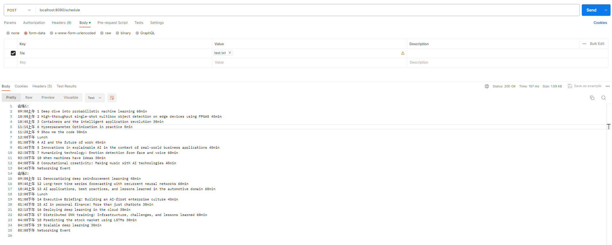

# Read Me First

这是一个会议调度服务，它的主要功能是根据输入的文件，解析出各个会议的信息，并进行合理的会议布置和安排。
主要类和方法

- ConferenceService: 这是主要的服务类，包含以下方法：
- schedule(MultipartFile file): 主要的调度方法，接收一个文件，解析出Talks，然后安排会议。
- parseFile(MultipartFile file): 解析文件，将每一行转换为一个Talk对象。
- scheduleConference(List<Talk> talks): 安排会议，将Talks分配到不同的Track和Session中。
- scheduleSession(Session session, LocalTime startTime, LocalTime endTime, List<Talk> talks):
  安排一个Session，将Talks分配到指定的时间段。
- fillIdleTime(Session session, LocalTime currentTime, LocalTime endTime, List<Talk> talks): 填充空闲时间，将剩余的Talks分配到空闲时间。
- formatConferenceSchedule(Conference conference): 格式化会议日程，将Conference对象转换为作业要求的格式。

# 使用方法

ConferenceController 是一个 Spring Boot REST 控制器，用于处理与会议调度相关的请求。
方法
schedule

此方法接收一个文件作为请求参数，并将其传递给 ConferenceService 进行处理。文件应包含会议的详细信息。处理后，会返回一个格式化的会议日程。

- 参数：file - 包含会议详细信息的文件。
- 返回：格式化的会议日程字符串。
- 异常：如果处理文件时出现问题，可能会抛出 IOException。
  依赖

此控制器依赖于 ConferenceService，用于处理会议调度和格式化会议日程。

首先，你需要创建一个ConferenceService对象，然后调用其schedule方法，传入你的会议信息文件。这个方法会返回一个Conference对象，表示调度后的会议信息。你可以调用formatConferenceSchedule方法，将这个Conference对象转换为可读的字符串，以便查看会议的调度结果。

# 注意事项

- 输入的文件应该是一个文本文件，每一行表示一个会议，格式为会议标题 会议时长。例如，Write Fast Tests Against Enterprise Rails
  60min。
- 根目录下有个mock数据（test.txt），可以直接按照上面使用方法执行：如图：
- 
- 会议的时长可以是lightning（表示5分钟）或者是一个以min结尾的数字（表示对应的分钟数）。例如，Overdoing it in Python
  lightning或者Lua for the Masses 30min。
- 会议的调度结果会尽可能地填满每个时间段，但是如果没有合适的会议可以填充空闲时间，那么这个时间段可能不会被完全填满。

